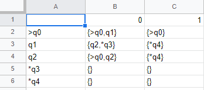

# Trabalho de Implementação DFA e conversor NFA

## Identificação

* Aluno: Eduardo Veloso Manhães Seabra - 201902902

## Pré-requisitos

- Compilador: Python 3
- Sistema Operacional: Windows 10

## Passos para compilar

1. Crie/Edite os arquivos de entrada
    1. entradaDFA.tsv
    
        

        

    2. stringsDFA.tsv
        * Exemplo de entrada

            
            
    3. entradaNFA.tsv
        * Basta realizar o mesmo da nossa entrada DFA
            
            

2. Compile o código python e execute o programa

## Link para o GitHub
    
* https://github.com/EdVeloso15/SimuladorDFA-ConversorNFA